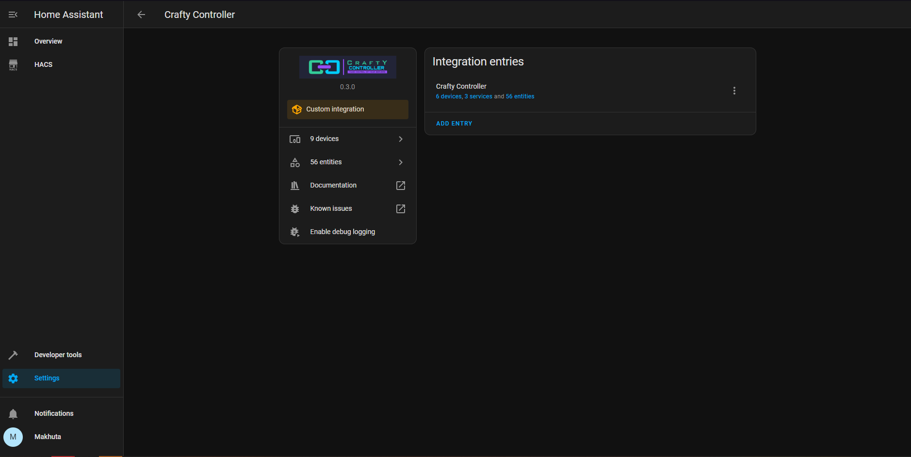
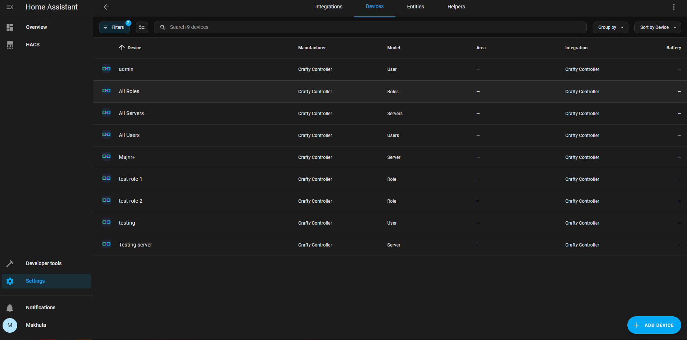
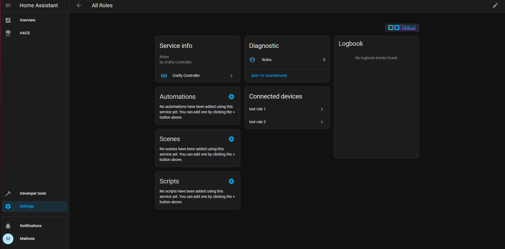
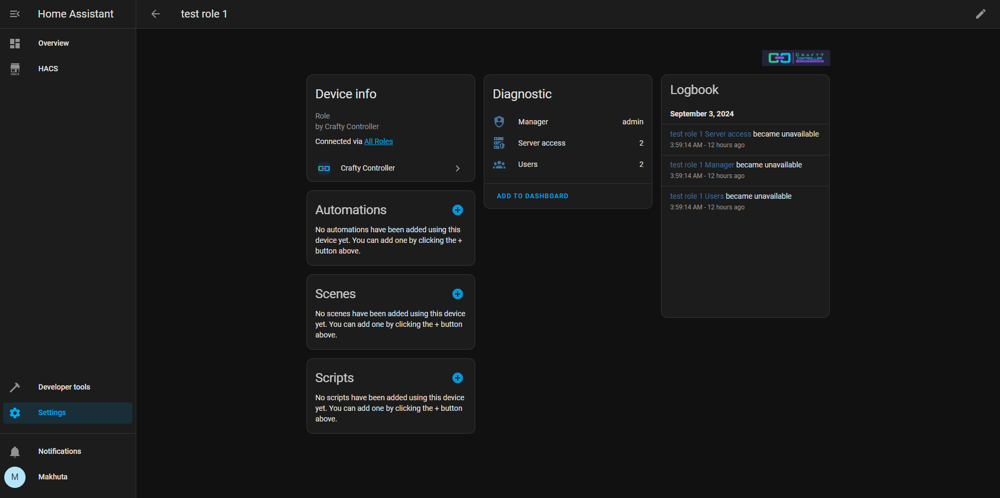
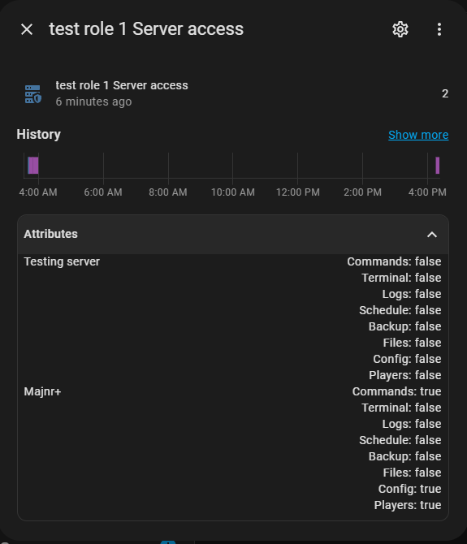
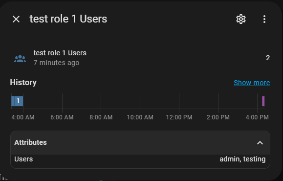
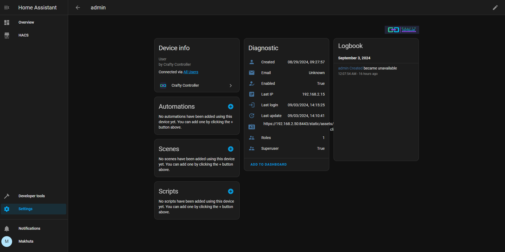
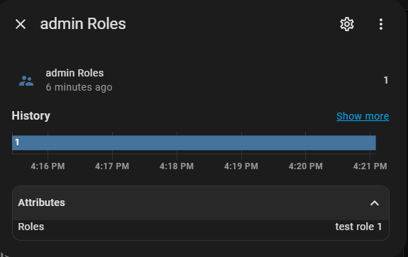
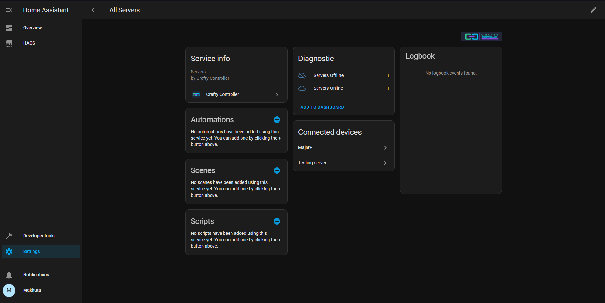
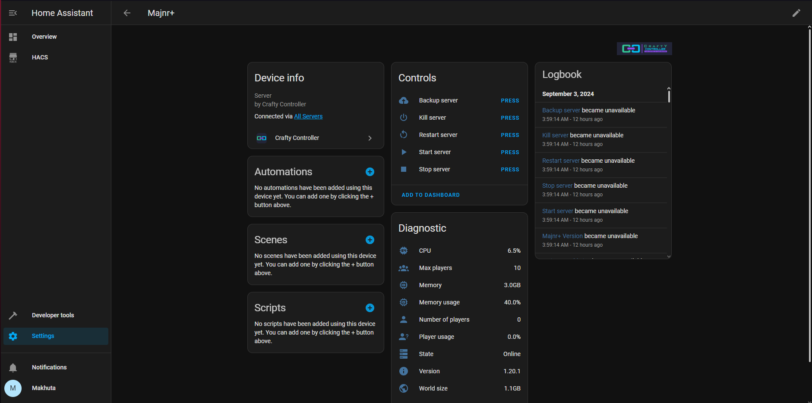

# Data scrapper for Crafty Controller
Adds multiple sensors, button with information/statistics/functions grabbed from Crafty Controller account

## Installation

### Requirements:

1. Install this component by copying [these files](https://github.com/Makhuta/homeassistant-crafty_controller/tree/main/custom_components/crafty_controller) to `custom_components/crafty_controller/`.
2. **You will need to restart after installation for the component to start working.**

### Adding new device

To add the **Crafty Controller** integration to your Home Assistant, use this My button:

<h3><b style="cursor: pointer">Manual configuration steps</b></h3>

If the above My button doesn’t work, you can also perform the following steps manually:

- Browse to your Home Assistant instance.

- Go to [Settings > Devices & Services](https://my.home-assistant.io/redirect/integrations/).

- In the bottom right corner, select the [Add Integration button.](https://my.home-assistant.io/redirect/config_flow_start?domain=crafty_controller)

- From the list, select **Crafty controller**.

- Follow the instructions on screen to complete the setup.

## Examples

### Installed device

This is the example of how succesfully installed Crafty integration should look like (there can be some differences in the number of devices/entities based on your *Crafty Controller* installation)

### All devices

At all time there will be at least 3 devices (All Roles, All Servers and All Users) and based on your Crafty installation there will be added another devices for each of them to provide nice UI.

### All roles

The Roles sensor will show the number of roles based on your specific settings and it will have connected the respective number of devices (roles) which will each have their own sensors

#### Examples for _testing role 1_

##### Example of _Server access_

Here you can see the number of servers **Role** has access to and the list of permissions for each server in sensor attributes.

##### Example of _Users_

This sensor shows the number of **Users** asigned to this role with list of users in its attributes.

### All users

The Users sensor will show the number of users your Crafty installation has (at least 1 should be there because you need the admin to log-in into the API)

#### Example for _admin_

##### Example of _Roles_

In this part the integration will provide you with ability to see the number of roles the **User** has been assigned to and in attributes you can see the list of their names.

### All servers

Here you are able to se 2 sensors:

1. **Servers Offline**: This will show the number of servers that are offline
2. **Servers Online**: This will obviously show the number of online servers

and next you can see that there are mentioned the servers that you have running (added) in Crafty Controller.

#### Example for _Majnr+_

Here you can at the first glance see that there is some controlls, with these you are able to control the respective server based on the button name. Next you can see multiple statistics of the selected server.

## Note

If you spot any sort of bug, error or incostintency don't hesitate to open issue [here](https://github.com/Makhuta/homeassistant-crafty_controller/issues).